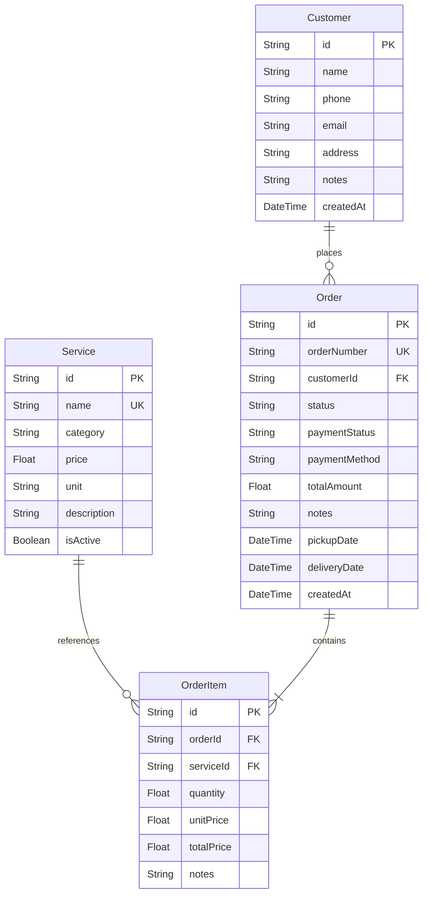

# AquaClean - Laundry Management System

AquaClean is a premium, high-fidelity Laundry Management System designed for modern dry cleaners and laundry businesses. Built on top of Next.js 16, React 19, Tailwind CSS, Prisma, and SQLite, it offers a fast, local-first administration panel to track orders, manage customer profiles, curate services, and view interactive revenue analytics.

---

## 🚀 Key Features

### 1. Interactive Analytics Dashboard
- **Key Metrics Overview**: Real-time tracking of Total Revenue, Active Orders, Pending Orders, and Total Orders with responsive micro-animations.
- **Revenue Trend Graph**: Smooth linear gradient AreaChart showing earnings over time.
- **Service Distribution Chart**: Interactive Donut/Pie chart visualizing item volume distribution by laundry type.
- **Recent Orders Tracker**: Live feed of the latest laundry submissions.

### 2. Live Order Management
- **Order Creation Wizard**: Link orders to existing customers, add multiple services with dynamic price totals, add service-specific instructions, set targeted delivery dates, and choose payment methods.
- **Visual Phase Tracker**: Step-by-step progress timeline tracking orders through laundry phases: `Pending` ➔ `Washing` ➔ `Drying` ➔ `Ironing` ➔ `Ready for Pickup` ➔ `Delivered`.
- **Quick Status Modifiers**: Instantly advance order status, cancel orders, or mark payments as Paid.
- **Printable Invoices**: Styled monochrome receipt rendering with a QR/barcode mockup for physical printing and pickup scanning.

### 3. Customer CRM Database
- **CRM Profiles**: Keep track of customer phone numbers, emails, addresses, and individual washing preferences (e.g. skin sensitivities, starch level).
- **Customer Metrics**: Real-time calculations of lifetime orders and overall spend.
- **Chronological Logs**: Access a customer's individual order history logs directly from their profile.

### 4. Service Pricing Catalog
- **Interactive Price Lists**: Services grouped into clear tabs (Wash & Dry, Dry Cleaning, Ironing, Specialty).
- **Flexible Billing Units**: Rates configurable per kilogram (`kg`) or per item (`piece`).
- **Availability Toggles**: Disable or enable services instantly from the catalog.

---

## 🛠️ Technology Stack

- **Core Framework**: [Next.js 16](https://nextjs.org/) (App Router, Server Components + API Route handlers)
- **Programming Language**: [TypeScript](https://www.typescriptlang.org/)
- **Styling**: [Tailwind CSS v4](https://tailwindcss.com/)
- **UI Components**: [shadcn/ui](https://ui.shadcn.com/) (Radix UI primitives & Lucide Icons)
- **Data Visualization**: [Recharts](https://recharts.org/)
- **Database ORM**: [Prisma Client v6](https://www.prisma.io/)
- **Database Engine**: [SQLite](https://sqlite.org/) (Local file-based system)

---

## 📊 Database Schema Layout

The database is built on four core relational tables:



---

## ⚙️ Local Setup Instructions

Follow these steps to initialize the database and run the development server locally:

### 1. Install Project Dependencies
Run the package installation using npm (or bun if available):
```bash
npm install
```

### 2. Configure Environment Variables
Make sure `.env` points to your local SQLite database path:
```env
DATABASE_URL="file:./db/custom.db"
```

### 3. Generate Prisma Client
Build the database client files matching your system architecture:
```bash
npx prisma generate
```

### 4. Push Schema to SQLite Database
Create the database tables and apply schema modifications:
```bash
npx prisma db push
```

### 5. Seed the Database
Populate the database with dummy services, customers, and mock order histories to get started:
```bash
node prisma/seed.js
```

### 6. Start the Development Server
Launch the local Next.js development server:
```bash
npm run dev
```

Open your browser and navigate to **[http://localhost:3000](http://localhost:3000)**.
